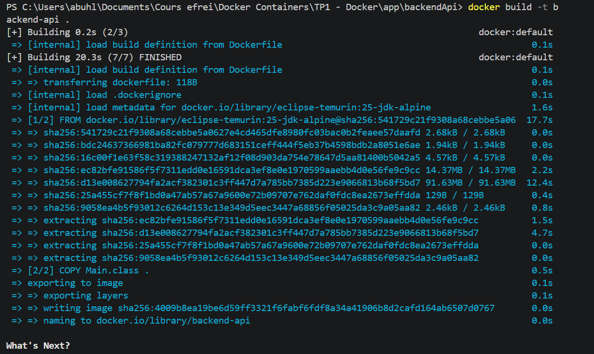
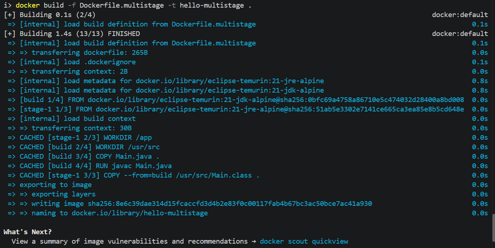
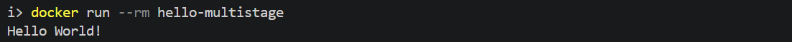

# Backend API - Hello World

## Basics

### Main.java

```java
public class Main {

   public static void main(String[] args) {
       System.out.println("Hello World!");
   }
}
```

### 1- Compile

```bash
javac Main.java
```

### 2- Dockerfile (only a JRE is needed at runtime)

```dockerfile
FROM eclipse-temurin:21-jre-alpine

COPY Main.class .

CMD ["java", "Main"]
```

### 3- Build and run

```bash
docker build -t backend-api .
docker run --rm backend-api
```



## Multistage build

The compilation is done by Docker in a JDK stage, and only the `.class` is copied into a JRE image.

`Dockerfile.multistage`:

```dockerfile
FROM eclipse-temurin:21-jdk-alpine AS build
WORKDIR /usr/src
COPY Main.java .
RUN javac Main.java

FROM eclipse-temurin:21-jre-alpine
WORKDIR /app
COPY --from=build /usr/src/Main.class .
CMD ["java", "Main"]
```

```bash
docker build -f Dockerfile.multistage -t hello-multistage .
docker run --rm hello-multistage
```





