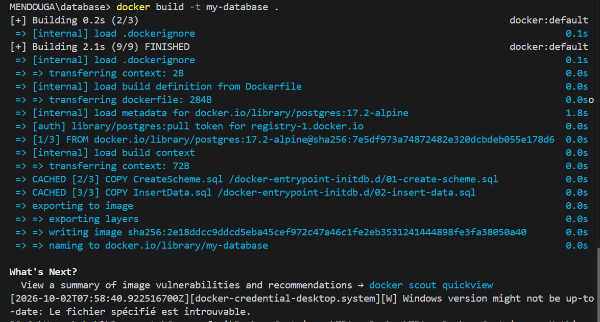
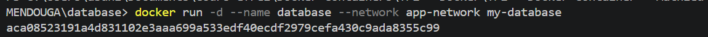
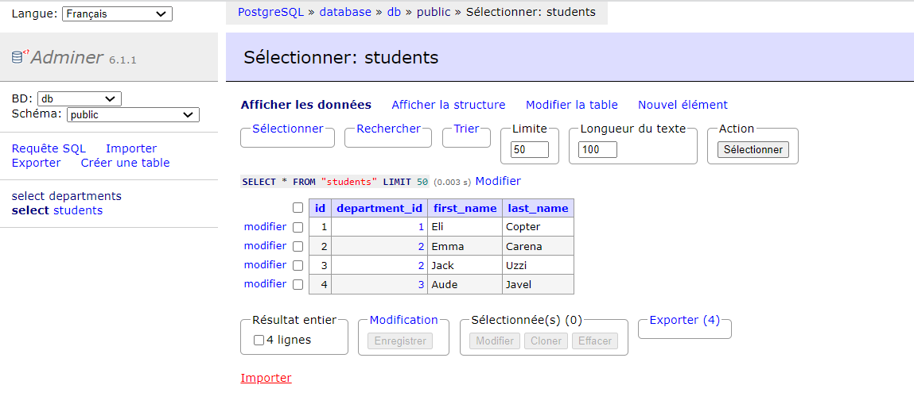
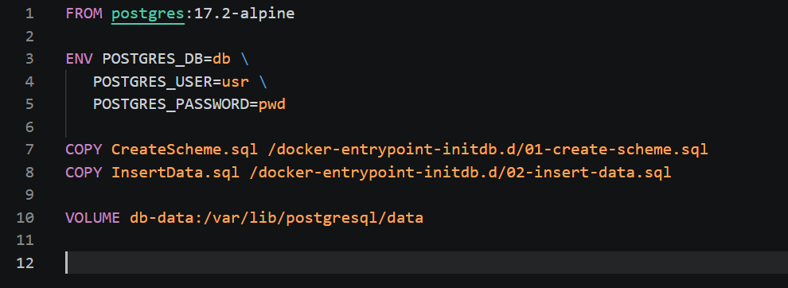

# Database

Image used: `postgres:17.2-alpine`.

## Basics

### Dockerfile

```dockerfile
FROM postgres:17.2-alpine

COPY CreateScheme.sql /docker-entrypoint-initdb.d/01-create-scheme.sql
COPY InsertData.sql /docker-entrypoint-initdb.d/02-insert-data.sql
```

### Network, build and run

```bash
docker network create app-network
docker build -t my-database .
docker run -d --name database --network app-network my-database
```





## Adminer

```bash
docker run -d --name adminer --network app-network -p 8090:8080 adminer
```


## Init database

Scripts: `CreateScheme.sql` (tables `departments` and `students`) and `InsertData.sql` (initial data).



## Persist data

The volume `db-data` is mounted on `/var/lib/postgresql/data`. 

```bash
docker rm -f database
docker run -d --name database --network app-network my-database
```



## Questions

### 1-1 Why is it better to use `-e` rather than putting the variables in the Dockerfile?

Everything written in a Dockerfile ends up in the image and in the Git repository, so anyone with the image or the code can read the password. With `-e` (or an `.env` file in compose) the secrets are given at runtime, can differ per environment, and can be changed without rebuilding the image.

### 1-2 Why do we need a volume attached to our postgres container?

The container filesystem is temporary: when the container is removed, its data is lost. A volume stores the data outside the container, on the host, so the database survives removal, recreation or upgrade of the container.

### 1-3 Document your database container essentials

Dockerfile: see above. Commands:

```bash
docker network create app-network
docker build -t my-database .
docker run -d --name database --network app-network \
  -e POSTGRES_DB=db -e POSTGRES_USER=usr -e POSTGRES_PASSWORD=pwd \
  -v db-data:/var/lib/postgresql/data my-database
docker run -d --name adminer --network app-network -p 8090:8080 adminer
```