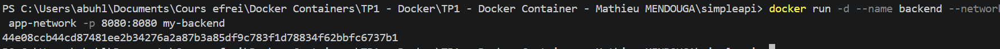
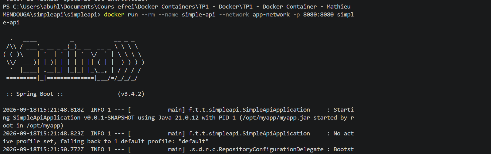
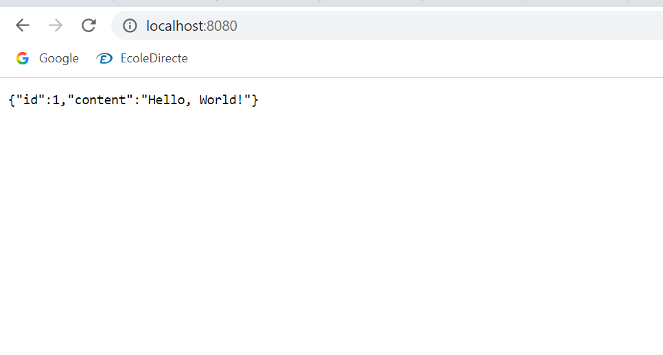

# Backend - Spring Boot simple API

Project generated with Spring Initializr (Maven, Java 21, Spring Boot 3.4.5, Spring Web), located in `simpleapi/`.

## Simple API (greeting endpoint)

```bash
docker build -t my-backend .
docker run -d --name backend --network app-network -p 8080:8080 my-backend
```




## API connected to the database

In `src/main/resources/application.yml`, the database is reached through the name of the database container on the Docker network:

```yaml
datasource:
  url: jdbc:postgresql://database:5432/db
  username: usr
  password: pwd
```




## Dockerfile

```dockerfile
# Build stage
FROM eclipse-temurin:21-jdk-alpine AS myapp-build
ENV MYAPP_HOME=/opt/myapp
WORKDIR $MYAPP_HOME

RUN apk add --no-cache maven

COPY pom.xml .
COPY src ./src
RUN mvn package -DskipTests

# Run stage
FROM eclipse-temurin:21-jre-alpine
ENV MYAPP_HOME=/opt/myapp
WORKDIR $MYAPP_HOME
COPY --from=myapp-build $MYAPP_HOME/target/*.jar $MYAPP_HOME/myapp.jar

ENTRYPOINT ["java", "-jar", "myapp.jar"]
```

### 1-4 Why do we need a multistage build? Explain each step

Building needs the JDK and Maven, which are heavy and useless once the application is compiled. With a multistage build, the final image only contains the JRE and the jar: it is smaller, faster to pull and has a smaller attack surface, and the build happens inside Docker so it does not depend on the developer's machine.

- `FROM eclipse-temurin:21-jdk-alpine AS myapp-build`: first stage with a JDK, named `myapp-build`.
- `ENV MYAPP_HOME=/opt/myapp` and `WORKDIR $MYAPP_HOME`: define and move to the working directory.
- `RUN apk add --no-cache maven`: install Maven in the build stage.
- `COPY pom.xml .` and `COPY src ./src`: copy the project descriptor and the sources.
- `RUN mvn package -DskipTests`: compile and package the application into a jar in `target/`.
- `FROM eclipse-temurin:21-jre-alpine`: second stage, a lightweight JRE-only image.
- `ENV` / `WORKDIR`: same working directory in the final image.
- `COPY --from=myapp-build ... myapp.jar`: take only the jar from the build stage.
- `ENTRYPOINT ["java", "-jar", "myapp.jar"]`: start the application when the container runs.